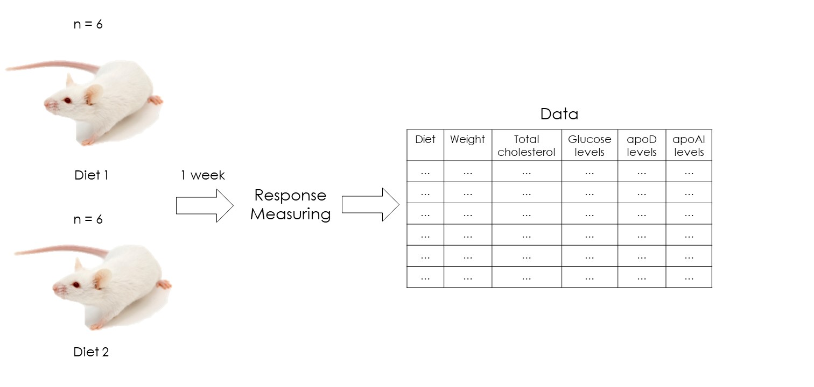
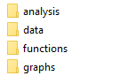
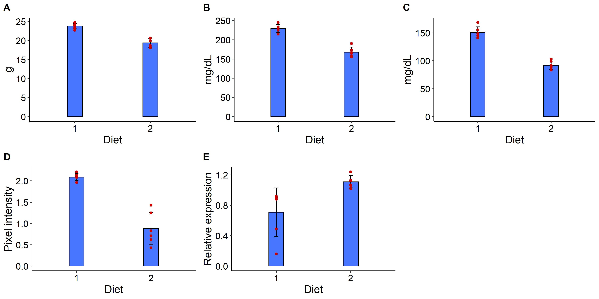
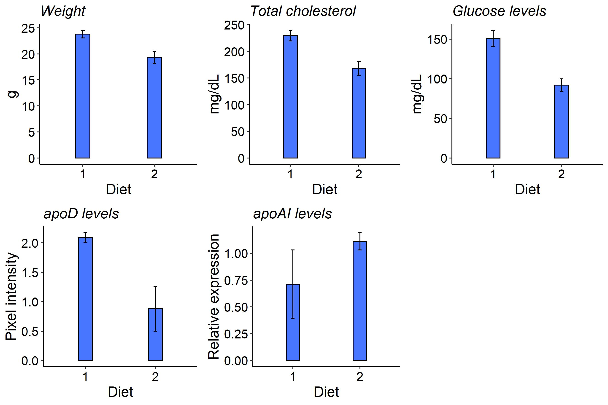
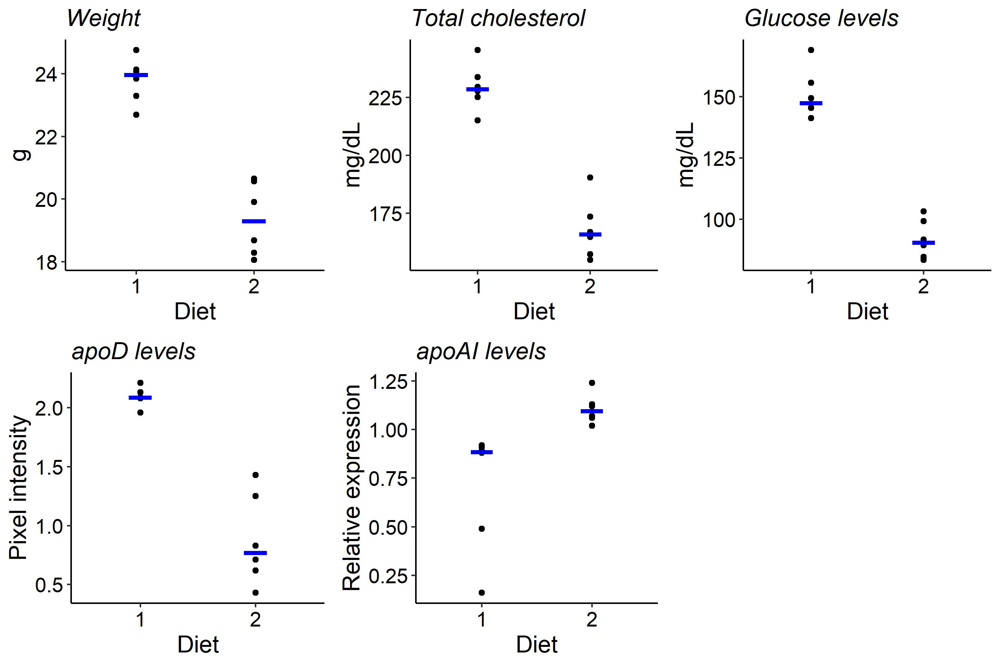

Two Treatments on Multiple Responses
================

A complete R tutorial about how to perform a comparison analysis between
two treatments on multiple responses. This is performed through a
t-Test, summarizing and graphing the data.

Note that I didn’t explain how I simulated the experimental data, but
you can see the code on data\_simulation.R

If you have cloned this repository and want to run this analysis from
scratch first run erase\_all\_outputs.R script and then run Main.R
script o whichever script you want.

The image and README\_files folders contain images that I’ve used on
this presentation.

Juan Pablo Carreón Hidalgo

<jpch_26@outlook.com>

## 1 Problem

You are interested on the effects of the consumption of a high fat-high
cholesterol diet in mice. To elucidate theses effects you plan and
perform an experiment with twelve animals. Six mice will consume a
regular diet while the remain will eat the fat as part of their diet.
After one week you register the data for five variable responses.



You put the responses information in a separated file.

<table class=" lightable-classic-2" style='font-family: "Arial Narrow", "Source Sans Pro", sans-serif; width: auto !important; margin-left: auto; margin-right: auto;'>

<caption>

Responses information

</caption>

<thead>

<tr>

<th style="text-align:left;">

Code

</th>

<th style="text-align:left;">

Description

</th>

<th style="text-align:left;">

Units

</th>

</tr>

</thead>

<tbody>

<tr>

<td style="text-align:left;">

WG

</td>

<td style="text-align:left;">

Weight

</td>

<td style="text-align:left;">

g

</td>

</tr>

<tr>

<td style="text-align:left;">

CH

</td>

<td style="text-align:left;">

Total cholesterol

</td>

<td style="text-align:left;">

mg/dL

</td>

</tr>

<tr>

<td style="text-align:left;">

GL

</td>

<td style="text-align:left;">

Glucose levels

</td>

<td style="text-align:left;">

mg/dL

</td>

</tr>

<tr>

<td style="text-align:left;">

PD

</td>

<td style="text-align:left;">

apoD levels

</td>

<td style="text-align:left;">

Pixel intensity

</td>

</tr>

<tr>

<td style="text-align:left;">

PI

</td>

<td style="text-align:left;">

apoAI levels

</td>

<td style="text-align:left;">

Relative expression

</td>

</tr>

</tbody>

</table>

apoD (apolipoprotein D) is a protein that could regulate triglyceride
metabolism. You can find more information for this and the other
responses in the paper: [A Western-Fed Diet Increases Plasma HDL and
LDL-Cholesterol Levels in ApoD–/–
Mice](https://journals.plos.org/plosone/article?id=10.1371/journal.pone.0115744).

apoAI (apolipoprotein A-I) is the major protein component of
high-density lipoproteins (HDL) is a multifunctional protein, involved
in cholesterol traffic and inflammatory and immune response regulation.
More information in [Apolipoprotein A-I (ApoA-I), Immunity, Inflammation
and Cancer](https://www.mdpi.com/2072-6694/11/8/1097).

Separately, you also make a separated file with your treatments and
other important information:

<table class=" lightable-classic-2" style='font-family: "Arial Narrow", "Source Sans Pro", sans-serif; width: auto !important; margin-left: auto; margin-right: auto;'>

<caption>

Treatments and other variables information

</caption>

<thead>

<tr>

<th style="text-align:left;">

Code

</th>

<th style="text-align:left;">

Description

</th>

<th style="text-align:left;">

Units

</th>

</tr>

</thead>

<tbody>

<tr>

<td style="text-align:left;">

IND

</td>

<td style="text-align:left;">

Mouse individual code

</td>

<td style="text-align:left;">

Not applicable

</td>

</tr>

<tr>

<td style="text-align:left;">

DT

</td>

<td style="text-align:left;">

Diet type

</td>

<td style="text-align:left;">

1: high fat/cholesterol diet, 2: regular

</td>

</tr>

</tbody>

</table>

On this table you can put other information related to variation
sources, like the gender (male or female). By the way, On this tutorial
we’re assuming that mice are all the same gender.

Finally, you’ve finished your experiment and your data look like this:

<table class=" lightable-classic-2" style='font-family: "Arial Narrow", "Source Sans Pro", sans-serif; width: auto !important; margin-left: auto; margin-right: auto;'>

<caption>

Experimental data

</caption>

<thead>

<tr>

<th style="text-align:left;">

IND

</th>

<th style="text-align:right;">

DT

</th>

<th style="text-align:right;">

WG

</th>

<th style="text-align:right;">

CH

</th>

<th style="text-align:right;">

GL

</th>

<th style="text-align:right;">

PD

</th>

<th style="text-align:right;">

PI

</th>

</tr>

</thead>

<tbody>

<tr>

<td style="text-align:left;">

7OX

</td>

<td style="text-align:right;">

1

</td>

<td style="text-align:right;">

23.29

</td>

<td style="text-align:right;">

215.05

</td>

<td style="text-align:right;">

149.25

</td>

<td style="text-align:right;">

2.08

</td>

<td style="text-align:right;">

0.16

</td>

</tr>

<tr>

<td style="text-align:left;">

A3P

</td>

<td style="text-align:right;">

1

</td>

<td style="text-align:right;">

22.69

</td>

<td style="text-align:right;">

227.76

</td>

<td style="text-align:right;">

168.96

</td>

<td style="text-align:right;">

1.96

</td>

<td style="text-align:right;">

0.88

</td>

</tr>

<tr>

<td style="text-align:left;">

JTY

</td>

<td style="text-align:right;">

1

</td>

<td style="text-align:right;">

24.08

</td>

<td style="text-align:right;">

245.45

</td>

<td style="text-align:right;">

145.43

</td>

<td style="text-align:right;">

2.21

</td>

<td style="text-align:right;">

0.49

</td>

</tr>

<tr>

<td style="text-align:left;">

39H

</td>

<td style="text-align:right;">

1

</td>

<td style="text-align:right;">

24.13

</td>

<td style="text-align:right;">

229.47

</td>

<td style="text-align:right;">

155.62

</td>

<td style="text-align:right;">

2.08

</td>

<td style="text-align:right;">

0.89

</td>

</tr>

<tr>

<td style="text-align:left;">

BK9

</td>

<td style="text-align:right;">

1

</td>

<td style="text-align:right;">

24.76

</td>

<td style="text-align:right;">

233.67

</td>

<td style="text-align:right;">

141.13

</td>

<td style="text-align:right;">

2.09

</td>

<td style="text-align:right;">

0.92

</td>

</tr>

<tr>

<td style="text-align:left;">

7DV

</td>

<td style="text-align:right;">

1

</td>

<td style="text-align:right;">

23.85

</td>

<td style="text-align:right;">

225.23

</td>

<td style="text-align:right;">

145.40

</td>

<td style="text-align:right;">

2.13

</td>

<td style="text-align:right;">

0.91

</td>

</tr>

<tr>

<td style="text-align:left;">

JUW

</td>

<td style="text-align:right;">

2

</td>

<td style="text-align:right;">

19.90

</td>

<td style="text-align:right;">

164.90

</td>

<td style="text-align:right;">

83.48

</td>

<td style="text-align:right;">

0.43

</td>

<td style="text-align:right;">

1.12

</td>

</tr>

<tr>

<td style="text-align:left;">

P78

</td>

<td style="text-align:right;">

2

</td>

<td style="text-align:right;">

18.68

</td>

<td style="text-align:right;">

155.00

</td>

<td style="text-align:right;">

89.38

</td>

<td style="text-align:right;">

1.43

</td>

<td style="text-align:right;">

1.06

</td>

</tr>

<tr>

<td style="text-align:left;">

5HF

</td>

<td style="text-align:right;">

2

</td>

<td style="text-align:right;">

20.56

</td>

<td style="text-align:right;">

157.38

</td>

<td style="text-align:right;">

103.17

</td>

<td style="text-align:right;">

0.71

</td>

<td style="text-align:right;">

1.13

</td>

</tr>

<tr>

<td style="text-align:left;">

Y5Y

</td>

<td style="text-align:right;">

2

</td>

<td style="text-align:right;">

20.65

</td>

<td style="text-align:right;">

173.57

</td>

<td style="text-align:right;">

91.69

</td>

<td style="text-align:right;">

1.25

</td>

<td style="text-align:right;">

1.02

</td>

</tr>

<tr>

<td style="text-align:left;">

G29

</td>

<td style="text-align:right;">

2

</td>

<td style="text-align:right;">

18.28

</td>

<td style="text-align:right;">

190.50

</td>

<td style="text-align:right;">

99.20

</td>

<td style="text-align:right;">

0.62

</td>

<td style="text-align:right;">

1.24

</td>

</tr>

<tr>

<td style="text-align:left;">

10H

</td>

<td style="text-align:right;">

2

</td>

<td style="text-align:right;">

18.06

</td>

<td style="text-align:right;">

166.98

</td>

<td style="text-align:right;">

84.67

</td>

<td style="text-align:right;">

0.83

</td>

<td style="text-align:right;">

1.07

</td>

</tr>

</tbody>

</table>

Each column code corresponds to those showed in the previous tables.

You wish to know if there are significant differences, as a effect of
the diet, on each response. You also want a nice summary for each one
and plots representing your data.

 

## 2 Solution

A first approach to this problem it would be reproduce on each response
(copy and paste) some analysis for just one response (like the explained
in
[Two-Treatment-Comparison](https://github.com/jpch26/Two-Treatments-Comparison)).
But this can be a little overwhelming if you want to apply global
changes to your data analysis. Imagine, you suddenly want to include
other statistics in your summaries or change the color of your plots to
be the same. This would make necessary to locate and change the code for
each response (five times in this tutorial).

Is there a way to avoid the prior problem and generalize our analysis?
Yes, we can use the power of functions and iteration methods to make a
reproducible analysis that can be applied to all your responses, no
matter how many you have.

First, my analysis directory includes the next folders:



  - The analysis folder contains my R scripts, one script for each
    analysis or plot.  
  - The data folder contains my data, my experimental data and my
    analysis products when their outputs produce text or CSV files.  
  - The graphs folder contains the plot outputs produced by their
    correspond R scripts.  
  - The functions folder contains my R functions, each one make possible
    to apply a operation set over a response, without copying and
    pasting the same code again and again.  
    Remember, you can organize your files other ways as long as you can
    ensure the reproducibility and clarity of your analysis.

Now, let’s make a t-Test, a summary and a plot for each response.

 

### 2.1 t-Test

A simple t-Test will tell us if there are significant differences
between diet data means. For this, firstly I’ve defined the next
function:

``` r
# T-test function ---------------------------------------------------------

# Perform a t-test given a response name, a model and data

ttest_func <- function(response = "", model = NULL, data = NULL, 
                        alpha = 0.05, ...) {
  
  # Convert to a formula if the given model is a character
  if (!class(model) == "formula") {
    model <- as.formula(model)
  }
  
  ## Determine if variances are equal through a F test
  ## Store the logical value to use in t.test
  var_equal_pvalue <- var.test(model, data)$p.value
  var_equal        <- var_equal_pvalue > alpha
  
  ## Perform a t test given the model and data arguments
  resp_tt <- t.test(
    model, data = data, conf.level = 1 - alpha, 
    var.equal = var_equal, ...
    )
  
  # Convert the t-test object to a character vector
  resp_tt <- unlist(resp_tt)
  
  # Convert to a data frame     
  resp_tt <- data.frame(
    c("Statistic t", "df", "p value", "Conf. lim. inf.", "Conf. lim. sup.",
      "Group 1 mean", "Group 2 mean", "Null hypotesis value", "Standard error",
      "Alternative", "Method", "Model", "Var. equal p value"), 
    c(unname(resp_tt), var_equal_pvalue)
    )
  
  # Rename columns
  names(resp_tt) <- c("Info", response)
  
  # Convert results elements, when is applicable, to a numeric element 
  # !is.na(as.numeric(...)) produces a warning message,
  # so I used suppressWarnings to avoid this messages
  suppressWarnings(
    num_elements <- !is.na(as.numeric(resp_tt[[response]]))
  )
  resp_tt[[response]][num_elements] <- round(
    as.numeric(resp_tt[[response]][num_elements]), 2
  ) 
  
  # Return the t-test
  return(resp_tt)
}
```

This function perform a completely customized t-Test analysis and
returns its results as a data frame. Let’s see how it works just
performing an individual analysis on total cholesterol:

``` r
main_data <- read.csv("data/main_data.csv")

ttest_tch <- ttest_func(response = "CH", model = CH ~ DT, data = main_data)
```

The result can be visualized if you type `ttest_tch`:

``` r
ttest_tch
```

    ##                    Info                 CH
    ## 1           Statistic t               9.21
    ## 2                    df                 10
    ## 3               p value                  0
    ## 4       Conf. lim. inf.              46.54
    ## 5       Conf. lim. sup.              76.23
    ## 6          Group 1 mean             229.44
    ## 7          Group 2 mean             168.06
    ## 8  Null hypotesis value                  0
    ## 9        Standard error               6.66
    ## 10          Alternative          two.sided
    ## 11               Method  Two Sample t-test
    ## 12                Model           CH by DT
    ## 13   Var. equal p value               0.59

The column `Info` shows the names of the results in the `CH` column,
this way we’ve obtained a statistic t value equal to 9.21 with a p-value
practically equals to 0. There are other results, like the treatment
means, the used method and, on the table bottom the p-value
corresponding to a F-test to establish if there is equal variances
between diets data. With this response the p-value is higher than 0.05,
so we can conclude that there is not enough evidence to establish that
variances are different.

The F-test within the function is run by the chunk of code:

``` r
## Determine if variances are equal through a F test
## Store the logical value to use in t.test
var_equal_pvalue <- var.test(model, data)$p.value
var_equal        <- var_equal_pvalue > alpha
```

The line `var_equal_pvalue <- var.test(model, data)$p.value` extracts
the p-value from the corresponding F-test. Note that anything else is
saved. The code `var_equal <- var_equal_pvalue > alpha` produces a
logical value (true or false) related to if we can reject the null
hypothesis about variances equality and stores this value to further use
in the chunk:

``` r
## Perform a t test given the model and data arguments
resp_tt <- t.test(
  model, data = data, conf.level = 1 - alpha, 
  var.equal = var_equal, ...
)
```

The previous code performs the t-Test analysis itself, using Two Sample
t-test if variances are equal or the Welch approximation if variances
are different. The argument `model` uses the given formula in the
function argument. Firstly the function double check if the class of
this object is right, otherwise changes the class to a formula using
`as.formula()`.

``` r
# Convert to a formula if the given model is a character
if (!class(model) == "formula") {
  model <- as.formula(model)
}
```

This checking will be useful when we extend the code to multiple
responses.

The remaining code just formats the analysis results and returns them as
a data frame:

``` r
# Convert the t-test object to a character vector
resp_tt <- unlist(resp_tt)

# Convert to a data frame     
resp_tt <- data.frame(
  c("Statistic t", "df", "p value", "Conf. lim. inf.", "Conf. lim. sup.",
    "Group 1 mean", "Group 2 mean", "Null hypotesis value", "Standard error",
    "Alternative", "Method", "Model", "Var. equal p value"), 
  c(unname(resp_tt), var_equal_pvalue)
)

# Rename columns
names(resp_tt) <- c("Info", response)

# Convert results elements, when is applicable, to a numeric element 
# !is.na(as.numeric(...)) produces a warning message,
# so I used suppressWarnings to avoid this messages
suppressWarnings(
  num_elements <- !is.na(as.numeric(resp_tt[[response]]))
)
resp_tt[[response]][num_elements] <- round(
  as.numeric(resp_tt[[response]][num_elements]), 2
) 

# Return the t-test
return(resp_tt)
```

The next step is to find a way to apply the previous function on all the
responses. For this I’ve organized my R analysis script as follows:

``` r
# T test analysis ---------------------------------------------------------

# Load required packages if they don't 
if (!"dplyr" %in% .packages()) library(dplyr)
if (!"purrr" %in% .packages()) library(purrr)

# 1 Source functions ------------------------------------------------------
source("functions/t_test_func.R")

# 2 Data ------------------------------------------------------------------

# 2.1 Import main Data
main_data <- read.csv(file = "data/main_data.csv")

# 2.2 Import response information
resp_info <- read.csv(file = "data/response_info.csv")

# 2.3 Response codes
resp_codes <- resp_info$Code

# 3 t-Test analysis on each response --------------------------------------

# 3.1 Define a character vector with the models
formulas  <- paste(resp_codes, "~ DT")

# 3.2 Apply t_test_fun on each response
ttest_ls <- vector(mode = "list", length = length(resp_codes))

for (i in 1:length(resp_codes)) {
  ttest_ls[[i]] <- ttest_func(
    response = resp_codes[i],
    model = formulas[i],
    data = main_data
    )
}

# 3.3 Join the list of data frames into one data frame
ttest_report <- Reduce(
  function(x, y, ...) full_join(x, y, by = "Info"),
  ttest_ls
)

# 4 Save the results data frame -------------------------------------------

write.csv(ttest_report, file = "data/ttest_report.csv", row.names = FALSE)
```

The first lines of code check if we loaded the necessary packages
already, if not, then uses the function `library()` to load them:

``` r
# Load required packages if they don't 
if (!"dplyr" %in% .packages()) library(dplyr)
if (!"purrr" %in% .packages()) library(purrr)
```

When you’re working on your own, you can omit the if statement and just
use `library()`.  
After the the previous code, I followed the path load your functions \>
import data \> make analysis \> save results. To load my t-Test function
I used the code `source("functions/t_test_func.R")` and then I imported
my main data (responses, treatments, and individual codes) with the next
code:

``` r
# 2 Data ------------------------------------------------------------------

# 2.1 Import main Data
main_data <- read.csv(file = "data/main_data.csv")

# 2.2 Import response information
resp_info <- read.csv(file = "data/response_info.csv")

# 2.3 Response codes
resp_codes <- resp_info$Code
```

The line `resp_codes <- resp_info$Code` assigns the responses code from
the response\_info table to `resp_codes`.

On the third chunk of code I properly performed the t-Test on all
responses:

``` r
# 3.1 Define a character vector with the models
formulas  <- paste(resp_codes, "~ DT")

# 3.2 Apply t_test_fun on each response
ttest_ls <- vector(mode = "list", length = length(resp_codes))

for (i in 1:length(resp_codes)) {
  ttest_ls[[i]] <- ttest_func(
    response = resp_codes[i],
    model = formulas[i],
    data = main_data
    )
}

# 3.3 Join the list of data frames into one data frame
ttest_report <- Reduce(
  function(x, y, ...) full_join(x, y, by = "Info"),
  ttest_ls
)
```

The line `formulas <- paste(resp_codes, "~ DT")` produces a character
vector with all models:

``` r
formulas
```

    ## [1] "WG ~ DT" "CH ~ DT" "GL ~ DT" "PD ~ DT" "PI ~ DT"

Next, I created a empty list with the line:

`ttest_ls <- vector(mode = "list", length = length(resp_codes))`.

This list has five empty spaces for each one of the analysis. Then the
magic is done through a for loop. What happened exactly? On the first
iteration (i = 1) within the for loop the evaluation is done as follows:

``` r
ttest_ls[[1]] <- ttest_func(
    response = resp_codes[1],
    model = formulas[1],
    data = main_data
    )
```

Then, the first element on `resp_codes` and `formulas` is used as
arguments to `ttest_func()`:

``` r
ttest_ls[[1]] <- ttest_func(
    response = "WG",
    model = "WG ~ DT",
    data = main_data
    )
```

And finally the function makes is work over the response `WG`. This
evaluation is repeated on each response and the result is saved in each
space of the list `ttest_ls`.

The next code is a fancy way to merge all the tables in `ttest_ls`:

``` r
# 3.3 Join the list of data frames into one data frame
ttest_report <- Reduce(
  function(x, y, ...) full_join(x, y, by = "Info"),
  ttest_ls
)
```

This code performs a some sort of iteration loop, that otherwise can be
complicated to put in a conventional for structure. You can see your
result by just typing `ttest_report` or by looking in the data folder,
the place I saved this table with the code:

`write.csv(ttest_report, file = "data/ttest_report.csv", row.names =
FALSE)`.

<table class=" lightable-classic-2" style='font-family: "Arial Narrow", "Source Sans Pro", sans-serif; width: auto !important; margin-left: auto; margin-right: auto;'>

<caption>

T test analysis on all responses

</caption>

<thead>

<tr>

<th style="text-align:left;">

Info

</th>

<th style="text-align:left;">

WG

</th>

<th style="text-align:left;">

CH

</th>

<th style="text-align:left;">

GL

</th>

<th style="text-align:left;">

PD

</th>

<th style="text-align:left;">

PI

</th>

</tr>

</thead>

<tbody>

<tr>

<td style="text-align:left;">

Statistic t

</td>

<td style="text-align:left;">

7.98

</td>

<td style="text-align:left;">

9.21

</td>

<td style="text-align:left;">

11.31

</td>

<td style="text-align:left;">

7.55

</td>

<td style="text-align:left;">

\-3.01

</td>

</tr>

<tr>

<td style="text-align:left;">

df

</td>

<td style="text-align:left;">

10

</td>

<td style="text-align:left;">

10

</td>

<td style="text-align:left;">

10

</td>

<td style="text-align:left;">

5.45

</td>

<td style="text-align:left;">

5.59

</td>

</tr>

<tr>

<td style="text-align:left;">

p value

</td>

<td style="text-align:left;">

0

</td>

<td style="text-align:left;">

0

</td>

<td style="text-align:left;">

0

</td>

<td style="text-align:left;">

0

</td>

<td style="text-align:left;">

0.03

</td>

</tr>

<tr>

<td style="text-align:left;">

Conf. lim. inf.

</td>

<td style="text-align:left;">

3.2

</td>

<td style="text-align:left;">

46.54

</td>

<td style="text-align:left;">

47.41

</td>

<td style="text-align:left;">

0.81

</td>

<td style="text-align:left;">

\-0.73

</td>

</tr>

<tr>

<td style="text-align:left;">

Conf. lim. sup.

</td>

<td style="text-align:left;">

5.69

</td>

<td style="text-align:left;">

76.23

</td>

<td style="text-align:left;">

70.66

</td>

<td style="text-align:left;">

1.62

</td>

<td style="text-align:left;">

\-0.07

</td>

</tr>

<tr>

<td style="text-align:left;">

Group 1 mean

</td>

<td style="text-align:left;">

23.8

</td>

<td style="text-align:left;">

229.44

</td>

<td style="text-align:left;">

150.96

</td>

<td style="text-align:left;">

2.09

</td>

<td style="text-align:left;">

0.71

</td>

</tr>

<tr>

<td style="text-align:left;">

Group 2 mean

</td>

<td style="text-align:left;">

19.36

</td>

<td style="text-align:left;">

168.06

</td>

<td style="text-align:left;">

91.93

</td>

<td style="text-align:left;">

0.88

</td>

<td style="text-align:left;">

1.11

</td>

</tr>

<tr>

<td style="text-align:left;">

Null hypotesis value

</td>

<td style="text-align:left;">

0

</td>

<td style="text-align:left;">

0

</td>

<td style="text-align:left;">

0

</td>

<td style="text-align:left;">

0

</td>

<td style="text-align:left;">

0

</td>

</tr>

<tr>

<td style="text-align:left;">

Standard error

</td>

<td style="text-align:left;">

0.56

</td>

<td style="text-align:left;">

6.66

</td>

<td style="text-align:left;">

5.22

</td>

<td style="text-align:left;">

0.16

</td>

<td style="text-align:left;">

0.13

</td>

</tr>

<tr>

<td style="text-align:left;">

Alternative

</td>

<td style="text-align:left;">

two.sided

</td>

<td style="text-align:left;">

two.sided

</td>

<td style="text-align:left;">

two.sided

</td>

<td style="text-align:left;">

two.sided

</td>

<td style="text-align:left;">

two.sided

</td>

</tr>

<tr>

<td style="text-align:left;">

Method

</td>

<td style="text-align:left;">

Two Sample t-test

</td>

<td style="text-align:left;">

Two Sample t-test

</td>

<td style="text-align:left;">

Two Sample t-test

</td>

<td style="text-align:left;">

Welch Two Sample t-test

</td>

<td style="text-align:left;">

Welch Two Sample t-test

</td>

</tr>

<tr>

<td style="text-align:left;">

Model

</td>

<td style="text-align:left;">

WG by DT

</td>

<td style="text-align:left;">

CH by DT

</td>

<td style="text-align:left;">

GL by DT

</td>

<td style="text-align:left;">

PD by DT

</td>

<td style="text-align:left;">

PI by DT

</td>

</tr>

<tr>

<td style="text-align:left;">

Var. equal p value

</td>

<td style="text-align:left;">

0.32

</td>

<td style="text-align:left;">

0.59

</td>

<td style="text-align:left;">

0.6

</td>

<td style="text-align:left;">

0

</td>

<td style="text-align:left;">

0.01

</td>

</tr>

</tbody>

</table>

 

### 2.2 Summary

It’s time to make a summary for each response, I’ll use my customized
function `sum_table()`:

``` r
# Summary function --------------------------------------------------------

sum_table <- function(data = NULL, group_factor, response) {
  
  sum <- data %>% 
    group_by({{ group_factor }}) %>% 
    summarise(
      min    = min({{ response }}),
      max    = max({{ response }}),
      range  = max - min,
      mean   = round(mean({{ response }}), 2), 
      median = round(median({{ response }}), 2),
      sd     = round(sd({{ response }}), 2),
      cv     = round((sd / mean) * 100, 2)
    )
  
  return(sum)
}
```

The double `{{}}` allows us to use `dplyr` functions within of ours.
`group_by()` tells to `summarize()` to perform the operations by
grouping by diet. This way, `summarize()` will calculate the statistics
we want for each diet. You can add or remover another statistics to your
own function.

My summary R script follows the same pattern than the t test script.

``` r
# Summaries for all responses ---------------------------------------------

# Load required packages if they don't 
if (!"dplyr" %in% .packages()) library(dplyr)
if (!"purrr" %in% .packages()) library(purrr)

# 1 Source functions ------------------------------------------------------
source("functions/summary_func.R")

# 2 Data ------------------------------------------------------------------

# 2.1 Import main data
main_data <- read.csv("data/main_data.csv")

# 2.2 Import response information
resp_info <- read.csv("data/response_info.csv")

# 2.2 Response codes
resp_code <- resp_info$Code

# 3 Summary for each response --------------------------------------------- 

# 3.1 Use sum_tables function to make summaries for all responses

sum_ls <- vector(mode = "list", length = length(resp_code))

for (i in 1:length(resp_code)) {
  
  temp_data <- select(main_data, DT, resp_code[i]) %>% 
    rename(resp = resp_code[i])
  
  sum_ls[[i]] <- sum_table(
    data = temp_data,
    group_factor = DT,
    response = resp
    )
}

# 4 Save each summary  ----------------------------------------------------
file_paths <- paste0("data/", resp_code, "_summary.csv")

walk2(sum_ls, file_paths, write.csv, row.names = FALSE)
```

First I checked if the needed packages are loaded already. Remember, you
can omit the if statement while working by your own.

``` r
# Load required packages if they don't 
if (!"dplyr" %in% .packages()) library(dplyr)
if (!"purrr" %in% .packages()) library(purrr)
```

Next I loaded my function and imported the experimental and responses
information data.

``` r
# 1 Source functions ------------------------------------------------------
source("functions/summary_func.R")

# 2 Data ------------------------------------------------------------------

# 2.1 Import main data
main_data <- read.csv("data/main_data.csv")

# 2.2 Import response information
resp_info <- read.csv("data/response_info.csv")

# 2.2 Response codes
resp_code <- resp_info$Code
```

This also can be unnecessary if you are working in the same session and
you already have done the t test analysis, but this way allows me to
work with each script as independent unit without relying on other
analysis scripts. So, If I want to reproduce or make some corrections in
just one analysis I just need the open its corresponding script.

On the third step I made the summaries using a for loop. The way I done
this is similar to that applied on the t test analysis.

``` r
# 3 Summary for each response --------------------------------------------- 

# 3.1 Use sum_tables function to make summaries for all responses
# summaries <- sum_tables(resp_names, data = main_data, group_factor = DT)

sum_ls <- vector(mode = "list", length = length(resp_code))

for (i in 1:length(resp_code)) {
  
  temp_data <- select(main_data, DT, resp_code[i]) %>% 
    rename(resp = resp_code[i])
  
  sum_ls[[i]] <- sum_table(
    data = temp_data,
    group_factor = DT,
    response = resp
    )
}
```

First I made and empty list and then put a summary in each spot with
`sum_table()`. You can also notice that I applied an extra step with the
code:

``` r
temp_data <- select(main_data, DT, resp_code[i]) %>% 
    rename(resp = resp_code[i])
```

The purpose of this code is allow us to apply the next code to all the
responses. To better clarity I can illustrate how the loop works on the
first iteration step (i = 1):

``` r
temp_data <- select(main_data, DT, resp_code[1]) %>% 
    rename(resp = resp_code[1])
  
  sum_ls[[1]] <- sum_table(
    data = temp_data,
    group_factor = DT,
    response = resp
    )
```

Then:

``` r
temp_data <- select(main_data, DT, "WG") %>% 
    rename(resp = "WG")
  
  sum_ls[[1]] <- sum_table(
    data = temp_data,
    group_factor = DT,
    response = resp
    )
```

So on this step `sum_table()` works only with the weight and diet data:

``` r
temp_data
```

<table class=" lightable-classic-2" style='font-family: "Arial Narrow", "Source Sans Pro", sans-serif; width: auto !important; margin-left: auto; margin-right: auto;'>

<thead>

<tr>

<th style="text-align:right;">

DT

</th>

<th style="text-align:right;">

resp

</th>

</tr>

</thead>

<tbody>

<tr>

<td style="text-align:right;">

1

</td>

<td style="text-align:right;">

23.29

</td>

</tr>

<tr>

<td style="text-align:right;">

1

</td>

<td style="text-align:right;">

22.69

</td>

</tr>

<tr>

<td style="text-align:right;">

1

</td>

<td style="text-align:right;">

24.08

</td>

</tr>

<tr>

<td style="text-align:right;">

1

</td>

<td style="text-align:right;">

24.13

</td>

</tr>

<tr>

<td style="text-align:right;">

1

</td>

<td style="text-align:right;">

24.76

</td>

</tr>

<tr>

<td style="text-align:right;">

1

</td>

<td style="text-align:right;">

23.85

</td>

</tr>

<tr>

<td style="text-align:right;">

2

</td>

<td style="text-align:right;">

19.90

</td>

</tr>

<tr>

<td style="text-align:right;">

2

</td>

<td style="text-align:right;">

18.68

</td>

</tr>

<tr>

<td style="text-align:right;">

2

</td>

<td style="text-align:right;">

20.56

</td>

</tr>

<tr>

<td style="text-align:right;">

2

</td>

<td style="text-align:right;">

20.65

</td>

</tr>

<tr>

<td style="text-align:right;">

2

</td>

<td style="text-align:right;">

18.28

</td>

</tr>

<tr>

<td style="text-align:right;">

2

</td>

<td style="text-align:right;">

18.06

</td>

</tr>

</tbody>

</table>

The response renaming in `response = resp` is what precisely allow us to
apply `sum_table()` on each response without worrying about each
response code.

Finally I put each summary on my data folder as a CSV file.

``` r
# 4 Save each summary  ----------------------------------------------------
file_paths <- paste0("data/", resp_code, "_summary.csv")

walk2(sum_ls, file_paths, write.csv, row.names = FALSE)
```

The code `file_paths <- paste0("data/", resp_code, "_summary.csv")`
creates a unique name for each response summary and at the same time
points where this results will be saved (the data folder).

The function `walk2()` from `purrr` package allows us to make iterative
process easier. So instead of using a for loop I just simply tell to
`walk2` which are my arguments (`sum_ls` and `file_paths`) and which
function I want to apply over them (`write.csv`). I didn’t use this
approach with the t test and summaries because for loops allows to be
more clear with complex process or multiple steps within the iteration
for loop while `purrr`functions can become a bit overwhelming with this
kind of operations.

So for simple iterations I use `purrr` and for complicated ones I used
for loops. More information about `purrr` package here:
[purrr](https://purrr.tidyverse.org/).

You can see each summary by looking and clicking on each file in the
data folder or by typing `sum_ls[[index]]` where `index` indicates which
summary you want to see. Note that the summaries order corresponds with
the given by the vector `resp_codes`, so `sum_ls[[1]]` will show you the
WG (Weight) summary:

``` r
sum_ls[[1]]
```

<table class=" lightable-classic-2" style='font-family: "Arial Narrow", "Source Sans Pro", sans-serif; width: auto !important; margin-left: auto; margin-right: auto;'>

<caption>

Weight summary

</caption>

<thead>

<tr>

<th style="text-align:right;">

DT

</th>

<th style="text-align:right;">

min

</th>

<th style="text-align:right;">

max

</th>

<th style="text-align:right;">

range

</th>

<th style="text-align:right;">

mean

</th>

<th style="text-align:right;">

median

</th>

<th style="text-align:right;">

sd

</th>

<th style="text-align:right;">

cv

</th>

</tr>

</thead>

<tbody>

<tr>

<td style="text-align:right;">

1

</td>

<td style="text-align:right;">

22.69

</td>

<td style="text-align:right;">

24.76

</td>

<td style="text-align:right;">

2.07

</td>

<td style="text-align:right;">

23.80

</td>

<td style="text-align:right;">

23.96

</td>

<td style="text-align:right;">

0.72

</td>

<td style="text-align:right;">

3.03

</td>

</tr>

<tr>

<td style="text-align:right;">

2

</td>

<td style="text-align:right;">

18.06

</td>

<td style="text-align:right;">

20.65

</td>

<td style="text-align:right;">

2.59

</td>

<td style="text-align:right;">

19.36

</td>

<td style="text-align:right;">

19.29

</td>

<td style="text-align:right;">

1.16

</td>

<td style="text-align:right;">

5.99

</td>

</tr>

</tbody>

</table>

Maybe you wish to merge all the summary tables but this can result in
something difficult to read, especially when you work with more than two
treatments and have many responses. Instead, why don’t just represent
your data or your summaries with a nice plot? Let’s put the code to
work.

### 2.3 Plots

To represent the mean and the standard deviation of each treatment let’s
make a bar plot and, in addition, overlay red points representing each
datum. The above of course for each response.

The sequence I followed to perform this analysis is the same that the
used with the t tests and the summaries tables.

``` r
# Bar Point Graphs   ------------------------------------------------------

## Load required packages if they don't 
if (!"dplyr" %in% .packages()) library(dplyr)
if (!"ggplot2" %in% .packages()) library(ggplot2)
if (!"purrr" %in% .packages()) library(purrr)

# 1 Source functions and global theme -------------------------------------
source("functions/bar_point_graph_func.R")
source("analysis/graph_theme.R")

# 2 Data -----------------------------------------------------------------

# 2.1 Import response information
resp_info <- read.csv("data/response_info.csv")

# 2.2 Response codes
resp_code <- resp_info$Code

# 2.3 File paths with the summary names
file_paths <- paste0("data/", resp_code, "_summary.csv")

# 2.4 Import summaries 
summaries <- map(file_paths, read.csv)

# 2.5 Import main data
main_data <- read.csv("data/main_data.csv")

# 3 Graph for each response ---------------------------------------------- 

# 3.1 Response units for y labs
resp_units <- resp_info$Units

# 3.2 Response names for main titles
resp_names <- resp_info$Description

# 3.3 Apply bar_point_graph function

graphs <- vector(mode = "list", length = length(resp_code))
for (i in 1:length(resp_code)) {
  
  # Subset main data
  sub_data <- select(main_data, DT, resp_code[i]) %>% 
    rename(resp = resp_code[i])
  
  # Make the graph
  graphs[[i]] <- bar_point_graph(
    data_1 = summaries[[i]],
    data_2 = sub_data,
    x = DT, 
    y_1 = mean, 
    y_2 = resp,
    x_lab = "Diet",
    y_lab = resp_units[i],
    main_title = resp_names[i]
  )
}

# 4 Save each graph -------------------------------------------------------

# File paths with graph names
graph_paths <- paste0("graphs/", resp_code, "_bar_point_graph.jpeg")

# Save each graph
walk2(graph_paths, graphs, ggsave)

# 5 Optional: Combine graphs ----------------------------------------------
if (!"ggpubr" %in% .packages()) library(ggpubr)

figure <- ggarrange(graphs[[1]], graphs[[2]], graphs[[3]], 
                    graphs[[4]], graphs[[5]], nrow = 2, ncol = 3)

ggsave(filename = "graphs/barpoint_figure.jpeg", plot = figure,
       units = "cm", width = 15, height = 10, scale = 1.5)
```

First I loaded my customized function and my global ggplot theme.

``` r
# 1 Source functions and global theme -------------------------------------
source("functions/bar_point_graph_func.R")
source("analysis/graph_theme.R")
```

`bar_point_graph_func()` uses two data frames, one corresponding to the
summary and the other corresponding to the raw data. Using both data the
function can overlay a bar and a point plot:

``` r
# Bar point graph function --------------------------------------------------

bar_point_graph <- function(data_1, data_2, x, y_1, err_bar = sd, y_2, 
                            x_lab = " ", y_lab = " ", main_title = "") {
  graph <- ggplot(
    data = data_1, 
    aes(x = as.factor({{ x }}), y = {{ y_1 }})
  ) +
    geom_col(
      width = 0.2, 
      color = "black", 
      fill = "royalblue1"
    ) +
    geom_errorbar(
      aes(ymin = {{ y_1 }} - {{ err_bar }}, 
          ymax = {{ y_1 }} + {{ err_bar }}), 
      width = 0.05
    ) +
    geom_point(
      data = data_2, 
      aes(x = {{ x }}, y = {{ y_2 }}),
      color = "red3"
    ) +
    xlab(x_lab) +
    ylab(y_lab) +
    ggtitle(main_title)
  
  return(graph)
}
```

The global theme script allows me to make aesthetic changes globally in
all graphs:

``` r
# Set a global theme for all graphs ------------------------------------------

theme_set(
  theme_classic() +
    theme(axis.text.x = element_text(color = "black", size = 13),
          axis.text.y = element_text(color = "black", size = 13),
          axis.title = element_text(color = "black", size = 15),
          plot.title=element_text(size=15, face = "italic"))
)
```

On the second step I imported the response summaries and the raw data:

``` r
# 2 Data -----------------------------------------------------------------

# 2.1 Import response information
resp_info <- read.csv("data/response_info.csv")

# 2.2 Response codes
resp_code <- resp_info$Code

# 2.3 File paths with the summary names
file_paths <- paste0("data/", resp_code, "_summary.csv")

# 2.4 Import summaries 
summaries <- map(file_paths, read.csv)

# 2.5 Import main data
main_data <- read.csv("data/main_data.csv")
```

The `map` function from `purrr` makes easier to import the summaries,
instead of using a for loop.

Next, I used a for loop to make each plot and saved them in the list
`graphs`. Here is more obvious why I prefer use for loops instead of
`purrr` with this kind of iteration patterns.

``` r
# 3 Graph for each response ---------------------------------------------- 

# 3.1 Response units for y labs
resp_units <- resp_info$Units

# 3.2 Response names for main titles
resp_names <- resp_info$Description

# 3.3 Apply bar_point_graph function

graphs <- vector(mode = "list", length = length(resp_code))
for (i in 1:length(resp_code)) {
  
  # Subset main data
  sub_data <- select(main_data, DT, resp_code[i]) %>% 
    rename(resp = resp_code[i])
  
  # Make the graph
  graphs[[i]] <- bar_point_graph(
    data_1 = summaries[[i]],
    data_2 = sub_data,
    x = DT, 
    y_1 = mean, 
    y_2 = resp,
    x_lab = "Diet",
    y_lab = resp_units[i],
    main_title = resp_names[i]
  )
}
```

I used the units of each response as y labs:

``` r
resp_units
```

    ## [1] "g"                   "mg/dL"              
    ## [3] "mg/dL"               "Pixel intensity"    
    ## [5] "Relative expression"

And the response names as the main titles:

``` r
resp_names
```

    ## [1] "Weight"            "Total cholesterol"
    ## [3] "Glucose levels"    "apoD levels"      
    ## [5] "apoAI levels"

On the first iteration, the elements corresponding to i = 1 in the
objects `summaries`, `resp_units` and `resp_names`, are used to make the
first plot (the Weight plot). You can see it by typing:

``` r
graphs[[1]]
```

<!-- -->

Finally I saved all the plot on the graphs folder using the code:

``` r
# 4 Save each graph -------------------------------------------------------

# File paths with graph names
graph_paths <- paste0("graphs/", resp_code, "_bar_point_graph.jpeg")

# Save each graph
walk2(graph_paths, graphs, ggsave)
```

So you can see each one by looking each file.

Optionally, you may want to put all the graphs in the same figure. This
is a simple task if you use the `ggarrange`function from the `ggpubr`
package:

``` r
# 5 Optional: Combine graphs ----------------------------------------------
if (!"ggpubr" %in% .packages()) library(ggpubr)

figure <- ggarrange(graphs[[1]], graphs[[2]], graphs[[3]], 
                    graphs[[4]], graphs[[5]], nrow = 2, ncol = 3)

ggsave(filename = "graphs/barpoint_figure.jpeg", plot = figure,
       units = "cm", width = 15, height = 10, scale = 1.5)
```

``` r
figure
```

<!-- -->

Note that I saved this plot as “bar\_point\_figure.jpeg” in the graphs
folder. Instead of the main titles in each plot, alternatively you can
omit them in the previous for loop and use the labels argument in the
`ggarrange` function to obtain some more related to a paper:

``` r
figure <- ggarrange(graphs[[1]], graphs[[2]], graphs[[3]], 
                    graphs[[4]], graphs[[5]], nrow = 2, ncol = 3,
                    labels = c("A", "B", "C", "D", "E"))
```

This way you would obtain something like this:

 Of course you also can follow
the same steps to make other kind of plots, like simple bar plots for
means and standard deviations:



Or point plots for raw data and their median:



Wow\! That’s it\! There’s no better way to learn than learning by doing.
Why don’t you try reproduce this whole analysis using your own data? The
code can be applied no matter how many responses you have.

To clone the repository for this analysis and reproduce it step by step
from scratch, click the next link: [Two Treatments Comparison on
Multiple
Responses](https://github.com/jpch26/Two-Treatments-Comparison-on-Multiple-Responses.git).

Feel free to modify, improve or extend the code. It’s all yours\!
